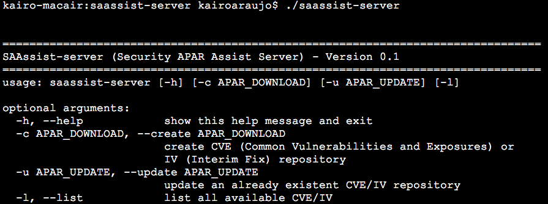
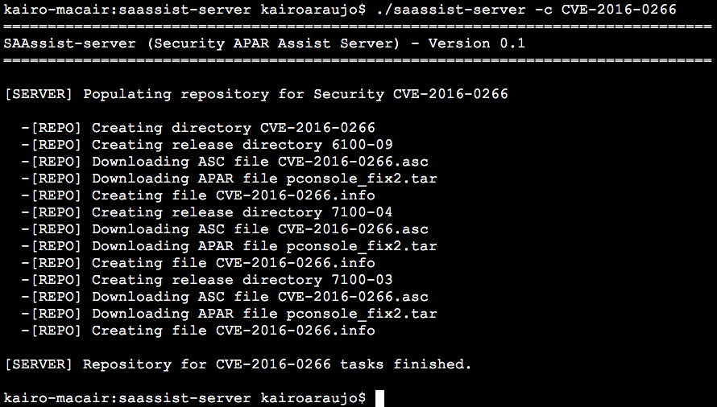
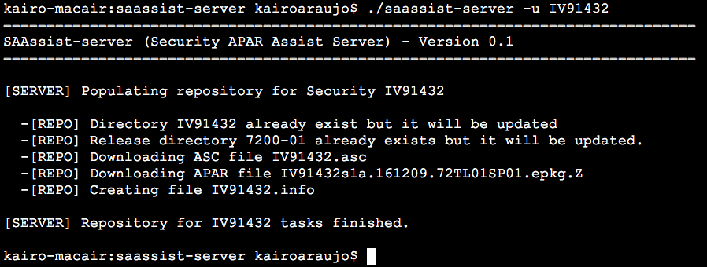
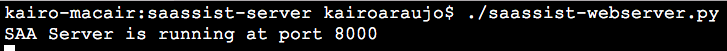
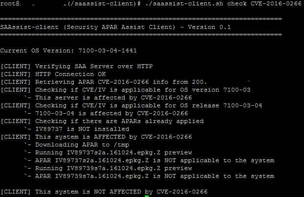
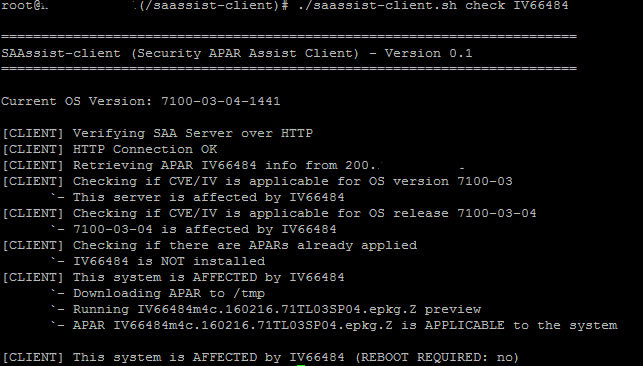
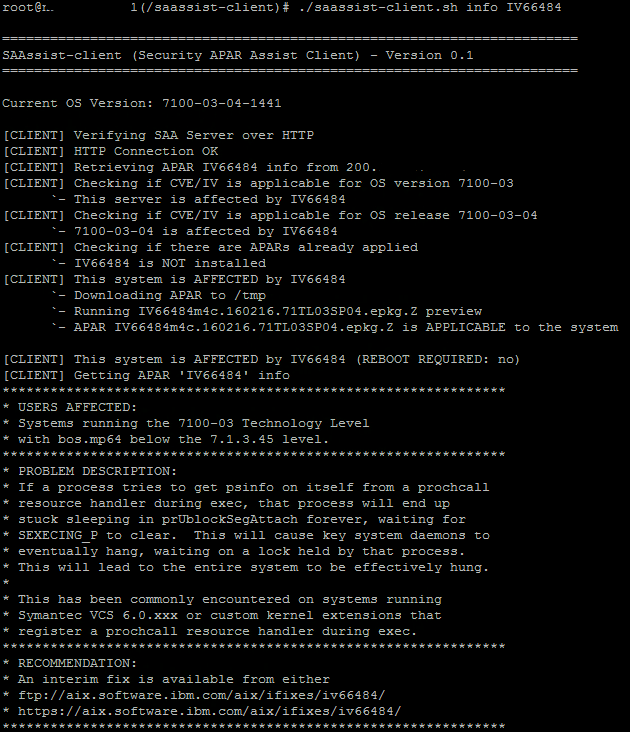
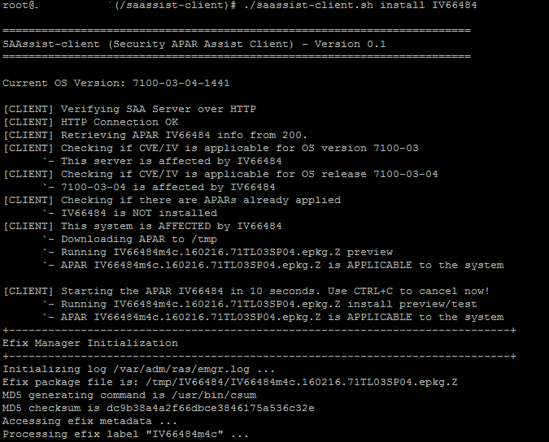
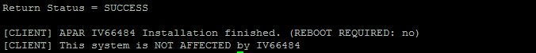

***********************
Security APAR Assistant
***********************

:SAAssist: Security APAR Assistant
:License: Apache 2.0
:Development: http://github.com/SAAssist

.. contents::
    :local:
    :depth: 3
    :backlinks: none

Overview
********

Security APAR Assist (SAAssist) is a tool to centralized and control the
security APARs for IBM AIX and IBM PowerVM environment.

SAAssist has two basic components, the SAAssist Server and SAAssist Client.

How it works
************

SAAssist Server (saassist-server) is the tool that works directly with IBM Fix
Level Recommendation Tool (FLRT) website and creates the repository with APARs
information and packages. Those APARs informations and packages are provided
to SAAssist Clients (saassist-client) by HTTP or NFS.

SAAssist Client (saassist-client) access the server by HTTP or NFS, get
informations about APARs to check if the APAR issue affects the server and
if desired this APAR fix can be installed.

Only the SAAssist Server needs to access the IBM FLRT website, proxy is also
supported, and SAAssist Client needs access only SAAssist Server by HTTP or NFS.

 .. code-block::

     _________________
    |                 | --------------[ Internet ]--------[ IBM FLRT website ]
    | saassist server |               * web proxy
    |_________________|
            |
            |
            `----- [  Repository  ]
                   [  info, fixes ]
                   [  HTTP: :NFS  ]
                           |
            .--------------'
            |
    ________|_________
    |                 |
    | saassist client |
    |_________________|
            |
            |
            |`---- {check}    verify if APAR is applicable & boot required
            |
            |`-----{info}     get detailed information about APAR (asc file)
            |
             `-----{install}  install APAR

SAAssist Server (saassist-server)
=================================

The SAAssist Server (saassist-server) is written in Python.

saassist-server access IBM FLRT website and collect all informations about an
specific CVE or IV number. It downloads data from website and store in a
repository to delivery to SAAssist Client (saassist-client) upon request
through HTTP or NFS.

The saassist-server include the HTTP server (saassist-webserver) if non static
HTTP server is available.

To use NFS is necessary that the system administrator exports the full path of
repository.

Using saassist-server
---------------------

The saassist-server is simple to be used. Do you need to run the saassist-server
specifying the CVE or IV number that you want to create (-c) on repository.

Example: ``saassist-server -c CVE-2016-3053`` or ``saassist-server -c IV88136``

The other options are -h to help of to -u update an existent CVE/IV.

Screenshots
^^^^^^^^^^^

* Help

* Creating repository for a CVE

* Updating a existing repository for IV

Running saassist-webserver
--------------------------

The web server is included, it runs as a temporally web server. If you want to
have a static HTTP Server is recommended install Apache or another one.
if you want to run this temporally, just run:

``saassist-webserver``

Screenshots
^^^^^^^^^^^

SAAssist Client (saassist-client)
=================================

The SAAssist Client (saassist-client) is written in Korn Shell (ksh).

This is a simple ksh script that access the SAAssist Server (saassist-server)
by HTTP or NFS and collect informations about a specific APAR (CVE/IV), check
if applicable for the server, check informations and install if required.

The only requirement is curl package if you want to use HTTP protocol, for NFS
protocol there is no requirements.

Using saassist-client
---------------------

The saassist-server is simple to be used. You need to run the saassist-client.sh
with the action (parameters) that you want to perform with the specific CVE or
IV Number.

To get full help use: ``saassist-client.sh help``

* check   : Verify if the system is affected by CVE/IV
* info    : Open the details about the CVE/IV if system is affected
* install : Install the APAR if it is available and applicable to the system

Example:

  ``saassist-client check CVE-2016-0281``

  ``saassist-client info IV91004``

  ``saassist-client install CVE-2016-0281``

Screenshots
^^^^^^^^^^^

* Checking

not affected

affected

* Reading info

* Install APAR/Fix

SAAssist Server (saassist-server) Installation
**********************************************

The dependencies to install the saassist-server is necessary Python version 3 and
BeautifulSoup4 module.

Installing Python 3
===================

Python version 3 is required by saassist-server and can run on Linux, AIX and
MacOS (Windows I have never tried, but I guess is possible also).

Follow bellow the instructions for Linux and AIX.

LINUX
-----

To install Python 3 use yum or apt-get of your distribution, also install pip3

``yum install python3 pip3``

AIX
---

I have been using this Python3 package to my environment that can be installed
using ``smitty install``

http://www.aixtools.net/index.php/python3

Installing BeautifulSoup4
=========================

BeautifulSoup is a Python package (module) and is required for saassist-server.
It can be installed using PIP

PIP
---

``pip3 install bs4``

Installing saassist-server
==========================

To install saassist-server you need to download the latest version, extract the
content and config the server_config.py file.

1. Download

    http://github.com/SAAssist/saassist-server

2. Extract

    .zip ``unzip saassist-server[version].zip``

    .tar ``tar xvf saassist-server[version].zip``

4. Configure the server_config.py

    All comments about the necessary information are inside of file.

    ``vi server_config.py``

SAAssist Client (saassist-client) Installation
**********************************************

If you want to use HTTP protocol, remember the package curl is required for IBM
AIX/PowerVM.

Download the saassist-client from the link, extract the files and configure
the client_config file.

1. Download

    http://github.com/SAAssist/saassist-client

2. Extract the files

    .zip ``unzip saassist-client[version].zip``

    .tar ``tar xvf saassist-client[version].zip``

4. Configure the client_config

    All comments about the necessary information are inside of file.

    ``vi client_config``

Developing
**********

SAAssist Server (saassist-server) is developed in Python (version 3) language

and SAAssist Client (saassist-client) is developed in Korn Shell (ksh).

saassist-server structure
=========================

.. code-block::

    * server_config.py is the configuration file (basic variables)

    * saassist-server(.py) is command constructor

    * saassist/saaserver.py is the server manager (repository content manager)
        - SAAServer()
          . repo_creation()

    * saassist/datacollector.py is the data collector that works with FLRT site
        - Collector()
          . apar_data()

    SCHEMA
    ======

    1. [ saassist-server.py ]
       { user: CVE / IV }
       { user: update or no }
       --> saassist/saaserver.py

    2. [ saassist/saaserver.py ]
       { invoke datacollector.py with CVE/IV }
       --> saassist/datacollector.py

    3. [ saassist/datacollector.py ]
       { access FLRT website }
       { do parsing of data }
       { return the data in a dictionary }
       saassist/saaserver <--

    4. [ saassist/saaserver.py ]
       { validate data }
       { create the repository data }
       { output actions: user }

saassist-client structure
=========================

saassist-client is a simple Korn Shell (ksh)

